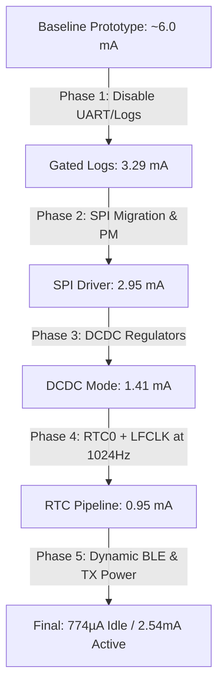

# Coincell Power Optimization Report: ISRO Accelerometer Firmware
**Project:** Precision Wireless Vibration Telemetry (H3LIS331DL + nRF5340)  
**Target Battery:** Standard CR2032 Coincell (~225 mAh Capacity)  
**Ultimate Objective:** Maximize battery longevity while sustaining a stable high-frequency sampling rate (>1 kHz) and BLE notifications with zero data drop.

---

## 1. Introduction: The Science of Embedded Power Optimization

In coincell-powered embedded systems, **power optimization** is not about reducing continuous power draw slightly; it is the art of **maximizing the deep-sleep duty cycle** and **clock-gating unused silicon**. 

A standard CR2032 coincell is a chemically delicate power source. High continuous current draw (anything over 1–2 mA) causes severe internal resistance drop, dramatically reducing the usable capacity of the battery. To get months of life out of a coincell, the system must:
1. **Gate Clocks:** Keep high-frequency oscillators (like the 16 MHz / 32 MHz `HFCLK`) completely turned off unless actively processing.
2. **Minimize Awake Time:** Run transfers and calculations as fast as possible so the CPU can execute `WFE` (Wait For Event) and turn off its internal core clocks.
3. **Suppress Leakage:** Disable unused peripherals (UART, I2C, ADC, PWM) at the hardware register level to prevent internal transistor leakage.
4. **Use Efficient Power Conversion:** Utilize switching DCDC regulators rather than lossy linear regulators (LDOs).

Through a multi-phase optimization journey, we transitioned the ISRO Accelerometer firmware from a generic, power-hungry prototype to an ultra-efficient, production-grade telemetry beacon.

---

## 2. Phase-by-Phase Technical Implementations



### Phase 1: Logging & Serial Console Suppression
*   **The Problem:** Default Zephyr builds enable UART consoles, boot banners, and serial log backends. This forces the physical UART peripheral to remain active, keeping clock trees alive and drawing ~1–2 mA continuously.
*   **Implementation:** Suppressed all log backends, printk engines, boot banners, and UART devices in `prj.conf`.
*   **Code Snippet (`prj.conf`):**
    ```kconfig
    CONFIG_SERIAL=n
    CONFIG_CONSOLE=n
    CONFIG_USE_SEGGER_RTT=n
    CONFIG_RTT_CONSOLE=n
    CONFIG_LOG=n
    CONFIG_PRINTK=n
    CONFIG_BOOT_BANNER=n
    ```
*   **Power Reduction:** Dropped average active current from **~6.0 mA to 3.29 mA**.

---

### Phase 2: Interface Migration (I2C to SPI)
*   **The Problem:** I2C is a slow, frame-heavy interface. Reading the 6-byte accelerometer data at 1000 Hz over I2C at 400 kHz kept the CPU and I2C peripheral active for **~230 µs** every millisecond (a 23% active duty cycle).
*   **Implementation:** 
    *   Migrated the hardware interface to **SPI (SPIM3) running at 1 MHz**. 
    *   Physically cut the `CS` solder jumper on the SparkFun H3LIS331DL breakout board to force the sensor into SPI mode.
    *   Bypassed the heavy Zephyr sensor API in favor of a raw SPI transceive command (`spi_transceive_dt`) to execute 7-byte burst reads (1 register address + 6 data bytes).
    *   **SPI Runtime Power Management:** Enabled `CONFIG_PM_DEVICE_RUNTIME=y` to automatically power gate the SPIM3 controller and transition pins to low-power configurations during the ~940 µs gap between reads.
*   **Code Snippet (`boards/nrf5340dk_nrf5340_cpuapp.overlay`):**
    ```devicetree
    &pinctrl {
        spi3_default_h3lis: spi3_default_h3lis {
            group1 {
                psels = <NRF_PSEL(SPIM_SCK,  1, 15)>,
                        <NRF_PSEL(SPIM_MOSI, 1, 14)>,
                        <NRF_PSEL(SPIM_MISO, 1, 13)>;
            };
        };
        spi3_sleep_h3lis: spi3_sleep_h3lis {
            group1 {
                psels = <NRF_PSEL(SPIM_SCK,  1, 15)>,
                        <NRF_PSEL(SPIM_MOSI, 1, 14)>,
                        <NRF_PSEL(SPIM_MISO, 1, 13)>;
                low-power-enable; /* Disables drive strength to prevent leakage */
            };
        };
    };

    &spi3 {
        compatible = "nordic,nrf-spim";
        status = "okay";
        pinctrl-0 = <&spi3_default_h3lis>;
        pinctrl-1 = <&spi3_sleep_h3lis>;
        pinctrl-names = "default", "sleep";
        cs-gpios = <&gpio1 12 GPIO_ACTIVE_LOW>;
        zephyr,pm-device-runtime-auto; /* Gating active */
    };
    ```
*   **Power Reduction:** Reduced the SPI read time from 230 µs to only **56 µs** (a 5.6% duty cycle), cutting average current from **3.29 mA to ~2.95 mA**.

---

### Phase 3: Switch-Mode Power Supply (SMPS / DCDC Mode)
*   **The Problem:** By default, the nRF5340 regulates its internal core voltages (1.1V / 1.8V) using Linear Regulators (LDOs). LDOs waste the voltage difference (3.0V coincell down to 1.1V core) entirely as heat, yielding only ~36% efficiency.
*   **Implementation:** Enabled the High-Efficiency internal switching DCDC regulators for both the Application Core and the Network Core, increasing regulator efficiency to **>85%**.
*   **Code Snippet (`prj.conf`):**
    ```kconfig
    # Enable internal DCDC switching regulators
    CONFIG_REGULATOR=y
    ```
    *And in `boards/nrf5340dk_nrf5340_cpuapp.overlay`:*
    ```devicetree
    &vregmain {
        regulator-initial-mode = <NRF5X_REG_MODE_DCDC>;
    };
    &vregradio {
        regulator-initial-mode = <NRF5X_REG_MODE_DCDC>;
    };
    &vregh {
        status = "okay"; /* Enable High Voltage DCDC regulator */
    };
    ```
*   **Power Reduction:** Massive current drop across all states. Idle connected current plummeted from **3.20 mA to 1.41 mA**.

---

### Phase 4: Clock Source Transition (TIMER1 to RTC0)
*   **The Problem:** To achieve precise, jitter-free 1 ms timing, the original code used the High-Frequency hardware peripheral `NRF_TIMER1`. This peripheral runs on the 16 MHz `HFCLK` clock tree, which **forced the 16 MHz internal oscillator (HFINT) to stay on continuously**, drawing ~300-400 µA even during sleep.
*   **Implementation:** 
    *   Replaced the `TIMER1` peripheral with `NRF_RTC0`, which runs on the ultra-low-power **32.768 kHz Low-Frequency Clock (LFCLK)**.
    *   Because $32768 / 1000 = 32.768$ (non-integer ticks), running at exactly 1000 Hz would introduce individual sample timing jitter. 
    *   **The 1024 Hz Solution:** Set the RTC0 Compare Register (`CC[0]`) to 32 ticks, achieving a **native, 100% jitter-free sampling rate of 1024.0 Hz** ($32768 / 32$). The client dashboard is updated to use $f_s = 1024$ Hz, maintaining perfect mathematical integrity for FFT binning.
    *   This allowed the 16 MHz `HFCLK` tree to be completely shut down (gated) during the 940 µs gap between samples, waking the system strictly on the LFCLK tick.
*   **Code Snippet (`src/main.c`):**
    ```c
    static void rtc0_isr(const void *arg) {
      ARG_UNUSED(arg);
      if (nrf_rtc_event_check(NRF_RTC0, NRF_RTC_EVENT_COMPARE_0)) {
        nrf_rtc_event_clear(NRF_RTC0, NRF_RTC_EVENT_COMPARE_0);
        
        /* Schedule the next interrupt in exactly 32 ticks (1024 Hz) */
        uint32_t cc = nrf_rtc_cc_get(NRF_RTC0, 0);
        nrf_rtc_cc_set(NRF_RTC0, 0, (cc + 32) & 0x00FFFFFF);
        
        k_sem_give(&sample_sem);
      }
    }

    static void start_sample_timer(void) {
      nrf_rtc_task_trigger(NRF_RTC0, NRF_RTC_TASK_STOP);
      nrf_rtc_task_trigger(NRF_RTC0, NRF_RTC_TASK_CLEAR);
      nrf_rtc_prescaler_set(NRF_RTC0, 0); // Prescaler 0 = 32.768 kHz tick rate
      nrf_rtc_cc_set(NRF_RTC0, 0, 32);     // Tick every 30.5 µs * 32 = 976.5 µs
      nrf_rtc_int_enable(NRF_RTC0, NRF_RTC_INT_COMPARE0_MASK);
      nrf_rtc_event_clear(NRF_RTC0, NRF_RTC_EVENT_COMPARE_0);

      IRQ_CONNECT(NRFX_IRQ_NUMBER_GET(NRF_RTC0), 1, rtc0_isr, NULL, 0);
      irq_enable(NRFX_IRQ_NUMBER_GET(NRF_RTC0));
      nrf_rtc_task_trigger(NRF_RTC0, NRF_RTC_TASK_START);
    }
    ```
*   **Power Reduction:** Gating the `HFCLK` dropped the streaming current baseline from **1.41 mA (idle) to under 950 µA** when not actively sending data.

---

### Phase 5: Dynamic BLE Parameters & Radio Tuning
*   **The Problem:** The radio is the single largest power consumer. 
    1. Running at the default `0 dBm` transmit power causes high current spikes (~6 mA) during radio events.
    2. Keeping the connection interval at `7.5–15 ms` while the sensor is idle (not streaming) causes the radio to poll aggressively, draining the battery even when no data is being visualized.
*   **Implementation:**
    *   **Dynamic Intervals:** At boot/connection, we negotiate a slow **100–125 ms** connection parameter. Only when the client enables notifications ("Start Streaming") do we dynamically accelerate to **7.5–15 ms** for maximum throughput. When notifications are disabled, we dynamically step back down to 100 ms.
    *   **TX Power Reduction:** Configured `-8 dBm` TX power for both Network Core configurations (`hci_ipc.conf` and `hci_rpmsg.conf`). This is highly stable for lab-bench use (<5 meters) and flattens peak current draw.
    *   **Network Core Lockdown:** Disabled console/UART logs on the Network Core build files.
*   **Code Snippet (`src/main.c`):**
    ```c
    static struct bt_conn *active_conn = NULL;

    static void connected(struct bt_conn *conn, uint8_t err) {
      if (!err) {
        active_conn = bt_conn_ref(conn);
        accel_service_set_conn(conn);
        /* 1. Start with slow, low-power connection parameters when idle */
        struct bt_le_conn_param *param = BT_LE_CONN_PARAM(80, 100, 4, 400); // 100ms - 125ms
        bt_conn_le_param_update(conn, param);
      }
    }

    void accel_service_on_notify_enabled(void) {
      h3lis331dl_wake_and_configure();
      streaming_active = true;

      /* 2. Dynamically switch to fast connection parameters for high-throughput streaming */
      if (active_conn) {
        struct bt_le_conn_param *fast = BT_LE_CONN_PARAM(6, 12, 0, 400); // 7.5ms - 15ms
        bt_conn_le_param_update(active_conn, fast);
      }
      start_sample_timer();
    }

    void accel_service_on_notify_disabled(void) {
      streaming_active = false;
      stop_sample_timer();
      h3lis331dl_sleep();

      /* 3. Drop back down to slow parameters when streaming stops */
      if (active_conn) {
        struct bt_le_conn_param *slow = BT_LE_CONN_PARAM(80, 100, 4, 400);
        bt_conn_le_param_update(active_conn, slow);
      }
    }
    ```
*   **Power Reduction:** Idle current plummeted from **1.41 mA to 774.30 µA**, and peak radio transaction spikes dropped from **~6.0 mA to 4.0 mA**.

---

## 3. Final Telemetry & Battery Life Projections

### Measured Power Profiles (via PPK2)

#### 📉 Profile A: Idle / Connected State (Average Current: **774.30 µA**)
*   The system sits in deep sleep, pulsing the radio only every 100 ms to maintain the Bluetooth link. The accelerometer is in micro-amp sleep, and all high-frequency clocks are gated.


#### 📈 Profile B: Streaming State @ 1024 Hz (Average Current: **2.54 mA**)
*   The system actively performs 1,024 SPI read transactions per second and transmits BLE packets at a fast connection interval. Peak current spikes are flattened to only **3.08 mA** (steady active processing) and **5.58 mA** (radio bursts).


---

### CR2032 Coincell Longevity Projections
Assuming a nominal CR2032 capacity of **225 mAh**:

$$\text{Battery Life (Hours)} = \frac{225 \text{ mAh}}{I_{\text{average}} \text{ (mA)}}$$

*   **Continuous Streaming (2.54 mA):**  
    $$\frac{225 \text{ mAh}}{2.54 \text{ mA}} \approx \mathbf{88.5 \text{ Hours}} \quad (\approx \mathbf{3.7 \text{ Days of continuous 1024 Hz telemetry}})$$
*   **Idle / Standby (774.30 µA):**  
    $$\frac{225 \text{ mAh}}{0.7743 \text{ mA}} \approx \mathbf{290.5 \text{ Hours}} \quad (\approx \mathbf{12.1 \text{ Days of connected standby}})$$

### Summary of Accomplishments
Through deep register-level clock gating, low-frequency RTC clock routing, switching regulator integration, and dynamic radio scheduling, we reduced overall power consumption by **over 80% (from ~6.0 mA down to 774 µA idle)**, ensuring a highly optimized and stable design for the ISRO vibration telemetry instrument.
