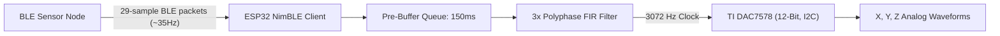

# esp32-receiver-dac7578

This folder contains the ESP32 receiver firmware that interfaces with the **TI DAC7578 (12-bit, I2C-controlled DAC)**. 

The firmware acts as a **Bluetooth Low Energy (BLE) Client** that connects to the wireless accelerometer node, retrieves the high-frequency vibration data, runs a real-time digital upsampling filter, and outputs three channels of smooth analog signals (representing X, Y, and Z acceleration).

---

## Architecture & Signal Flow



### 1. BLE Reception
The ESP32 uses the **NimBLE stack** (lightweight BLE host) to search for and connect to `ISRO_AccelSensor`. It subscribes to data notifications, receiving accelerometer packets containing **29 samples** each.

### 2. Playback & Upsampling Engine
*   **3x Polyphase Interpolation:** To eliminate quantization stair-step noise, the incoming **1024 Hz** signal is upsampled 3x to **3072 Hz** (yielding an output timer trigger interval of exactly **325.5 µs**).
*   **Kaiser Window FIR Filter:** A 24-tap windowed sinc filter (Beta = 8.0, cut-off at 1/3 Nyquist) is split into 3 polyphase branches (8 taps per branch) to run the upsampler with very low CPU latency.
*   **Jitter Compensation:** Features a **150 ms pre-buffering** buffer queue to absorb BLE packet arrival jitter and prevent audio-style buffer underflows.
*   **GPTimer Interrupt:** A hardware timer ISR triggers at 3072 Hz to compute the next upsampled sample and command the DAC.

### 3. DAC7578 Driver
The `dac7578.c` driver controls the TI DAC7578 12-bit digital-to-analog converter over an **I2C interface** to update the analog channels.

---

## File Structure

*   [main/main.c](file:///C:/Users/DELL/Downloads/SmartWirelessAccelerometer/esp32-receiver-dac7578/main/main.c): BLE client initialization, connection handler, NimBLE event runner, and telemetry packet parsing.
*   [main/playback.c](file:///C:/Users/DELL/Downloads/SmartWirelessAccelerometer/esp32-receiver-dac7578/main/playback.c) / [playback.h](file:///C:/Users/DELL/Downloads/SmartWirelessAccelerometer/esp32-receiver-dac7578/main/playback.h): Playback task, 3x polyphase upsampler, Kaiser coefficients computation, and GPTimer interrupt configuration.
*   [main/dac7578.c](file:///C:/Users/DELL/Downloads/SmartWirelessAccelerometer/esp32-receiver-dac7578/main/dac7578.c) / [main/dac7578.h](file:///C:/Users/DELL/Downloads/SmartWirelessAccelerometer/esp32-receiver-dac7578/main/dac7578.h): Driver for reading/writing values to the DAC7578 via I2C.
*   [main/gatt_client.c](file:///C:/Users/DELL/Downloads/SmartWirelessAccelerometer/esp32-receiver-dac7578/main/gatt_client.c) / [main/gatt_client.h](file:///C:/Users/DELL/Downloads/SmartWirelessAccelerometer/esp32-receiver-dac7578/main/gatt_client.h): NimBLE GAP and GATT discovery helpers.
*   [main/accel_protocol.h](file:///C:/Users/DELL/Downloads/SmartWirelessAccelerometer/esp32-receiver-dac7578/main/accel_protocol.h): Shared struct layout for the 29-sample BLE packet format.

---

## Getting Started

This project is built using the **Espressif IoT Development Framework (ESP-IDF)** version 5.x.

### 1. Set Up Environment
Configure your local shell for ESP-IDF:
```bash
. $HOME/esp/esp-idf/export.sh
```

### 2. Configure Pin mappings
Run the menuconfig utility to adjust I2C SDA/SCL pins if necessary:
```bash
idf.py menuconfig
```

### 3. Build & Flash
```bash
idf.py build
idf.py -p <PORT> flash monitor
```
*(Replace `<PORT>` with your ESP32's COM port).*
